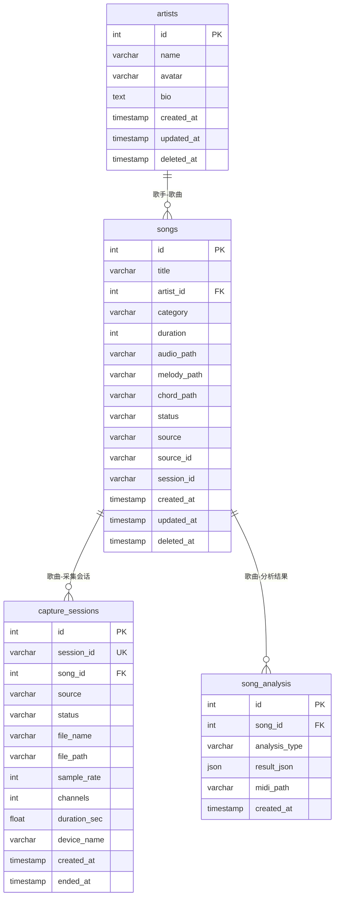

# 数据库表结构设计

## 1. 概述

本文档定义音乐扒谱应用的数据库表结构。

### 设计原则
- 每个表使用 InnoDB 引擎，UTF8MB4 编码
- 主键使用自增 ID
- 时间戳使用 DATETIME 或 TIMESTAMP
- 软删除使用 `deleted_at` 字段

---

## 2. 表结构

### 2.1 歌手表 (artists)

存储歌手/演奏者信息

| 字段名 | 类型 | 可空 | 默认值 | 说明 |
|--------|------|------|--------|------|
| id | INT | 否 | AUTO_INCREMENT | 主键 |
| name | VARCHAR(100) | 否 | - | 歌手名字 |
| avatar | VARCHAR(500) | 是 | NULL | 头像 URL |
| bio | TEXT | 是 | NULL | 简介 |
| created_at | TIMESTAMP | 否 | CURRENT_TIMESTAMP | 创建时间 |
| updated_at | TIMESTAMP | 否 | CURRENT_TIMESTAMP ON UPDATE | 更新时间 |
| deleted_at | TIMESTAMP | 是 | NULL | 删除时间（软删除） |

**索引:**
- `idx_name` (name)
- `idx_deleted_at` (deleted_at)

---

### 2.2 歌曲表 (songs)

存储歌曲信息及扒谱结果

| 字段名 | 类型 | 可空 | 默认值 | 说明 |
|--------|------|------|--------|------|
| id | INT | 否 | AUTO_INCREMENT | 主键 |
| title | VARCHAR(255) | 否 | - | 歌曲名 |
| artist_id | INT | 是 | NULL | 关联歌手 ID |
| category | VARCHAR(50) | 是 | NULL | 歌曲类别（如：流行、古典、摇滚） |
| duration | INT | 是 | 0 | 时长（毫秒） |
| audio_path | VARCHAR(500) | 是 | NULL | 原始音频文件路径（WAV） |
| melody_path | VARCHAR(500) | 是 | NULL | 旋律 MIDI 文件路径 |
| chord_path | VARCHAR(500) | 是 | NULL | 和弦 MIDI 文件路径 |
| status | VARCHAR(20) | 否 | 'pending' | 状态：pending/processing/completed/failed |
| source | VARCHAR(50) | 是 | NULL | 来源：wasapi/local/spotify |
| source_id | VARCHAR(100) | 是 | NULL | 来源 ID（如 Spotify track ID） |
| session_id | VARCHAR(100) | 是 | NULL | 采集会话 ID |
| created_at | TIMESTAMP | 否 | CURRENT_TIMESTAMP | 创建时间 |
| updated_at | TIMESTAMP | 否 | CURRENT_TIMESTAMP ON UPDATE | 更新时间 |
| deleted_at | TIMESTAMP | 是 | NULL | 删除时间（软删除） |

**索引:**
- `idx_artist_id` (artist_id)
- `idx_status` (status)
- `idx_source` (source)
- `idx_session_id` (session_id)
- `idx_deleted_at` (deleted_at)

---

### 2.3 采集会话表 (capture_sessions)

存储 WASAPI 音频采集会话信息

| 字段名 | 类型 | 可空 | 默认值 | 说明 |
|--------|------|------|--------|------|
| id | INT | 否 | AUTO_INCREMENT | 主键 |
| session_id | VARCHAR(100) | 否 | - | 会话唯一 ID |
| song_id | INT | 是 | NULL | 关联歌曲 ID |
| source | VARCHAR(50) | 否 | 'system_loopback' | 采集来源 |
| status | VARCHAR(20) | 否 | 'ready' | 状态 |
| file_name | VARCHAR(255) | 是 | NULL | 录音文件名 |
| file_path | VARCHAR(500) | 是 | NULL | 录音文件路径 |
| sample_rate | INT | 是 | 0 | 采样率 |
| channels | INT | 是 | 0 | 声道数 |
| duration_sec | FLOAT | 是 | 0 | 时长（秒） |
| device_name | VARCHAR(255) | 是 | NULL | 录音设备名称 |
| created_at | TIMESTAMP | 否 | CURRENT_TIMESTAMP | 创建时间 |
| ended_at | TIMESTAMP | 是 | NULL | 结束时间 |

**索引:**
- `idx_session_id` (session_id UNIQUE)
- `idx_song_id` (song_id)
- `idx_status` (status)

---

### 2.4 歌曲分析结果表 (song_analysis)

存储歌曲的详细分析结果

| 字段名 | 类型 | 可空 | 默认值 | 说明 |
|--------|------|------|--------|------|
| id | INT | 否 | AUTO_INCREMENT | 主键 |
| song_id | INT | 否 | - | 关联歌曲 ID |
| analysis_type | VARCHAR(50) | 否 | - | 分析类型：melody/chord/lyrics |
| result_json | JSON | 是 | NULL | 分析结果（JSON） |
| midi_path | VARCHAR(500) | 是 | NULL | MIDI 文件路径 |
| created_at | TIMESTAMP | 否 | CURRENT_TIMESTAMP | 创建时间 |

**索引:**
- `idx_song_id` (song_id)
- `idx_analysis_type` (analysis_type)

---

## 3. 表关系图

```
┌─────────────┐       ┌─────────────┐
│   artists   │       │    songs    │
├─────────────┤       ├─────────────┤
│ id (PK)     │◄──────│ artist_id   │
│ name        │       │ id (PK)     │
│ avatar      │       │ title       │
│ bio         │       │ category    │
└─────────────┘       │ audio_path  │
                      │ melody_path │
                      │ chord_path  │
                      │ status      │
                      │ session_id  │
                      └──────┬──────┘
                             │
                             ▼
                      ┌─────────────────┐
                      │capture_sessions│
                      ├─────────────────┤
                      │ session_id (PK) │
                      │ song_id (FK)    │
                      │ status          │
                      │ file_path       │
                      └─────────────────┘
```

---

## 4. 状态说明

### songs.status
| 状态 | 说明 |
|------|------|
| pending | 待处理 |
| processing | 处理中 |
| completed | 已完成 |
| failed | 失败 |

### capture_sessions.status
| 状态 | 说明 |
|------|------|
| ready | 就绪 |
| recording_requested | 请求录制中 |
| recording | 录制中 |
| recorded | 已录制 |
| transcribing | 识别中 |
| done | 完成 |
| failed | 失败 |

---

## 5. SQL 建表语句

```sql
-- 创建数据库
CREATE DATABASE IF NOT EXISTS music_chrod_project 
    DEFAULT CHARACTER SET utf8mb4 
    DEFAULT COLLATE utf8mb4_unicode_ci;

USE music_chrod_project;

-- 歌手表
CREATE TABLE IF NOT EXISTS artists (
    id INT AUTO_INCREMENT PRIMARY KEY,
    name VARCHAR(100) NOT NULL COMMENT '歌手名字',
    avatar VARCHAR(500) DEFAULT NULL COMMENT '头像URL',
    bio TEXT DEFAULT NULL COMMENT '简介',
    created_at TIMESTAMP DEFAULT CURRENT_TIMESTAMP COMMENT '创建时间',
    updated_at TIMESTAMP DEFAULT CURRENT_TIMESTAMP ON UPDATE CURRENT_TIMESTAMP COMMENT '更新时间',
    deleted_at TIMESTAMP DEFAULT NULL COMMENT '删除时间',
    INDEX idx_name (name),
    INDEX idx_deleted_at (deleted_at)
) ENGINE=InnoDB DEFAULT CHARSET=utf8mb4 COMMENT='歌手表';

-- 歌曲表
CREATE TABLE IF NOT EXISTS songs (
    id INT AUTO_INCREMENT PRIMARY KEY,
    title VARCHAR(255) NOT NULL COMMENT '歌曲名',
    artist_id INT DEFAULT NULL COMMENT '关联歌手ID',
    category VARCHAR(50) DEFAULT NULL COMMENT '歌曲类别',
    duration INT DEFAULT 0 COMMENT '时长(毫秒)',
    audio_path VARCHAR(500) DEFAULT NULL COMMENT '原始音频文件路径',
    melody_path VARCHAR(500) DEFAULT NULL COMMENT '旋律MIDI文件路径',
    chord_path VARCHAR(500) DEFAULT NULL COMMENT '和弦MIDI文件路径',
    status VARCHAR(20) DEFAULT 'pending' DEFAULT 'pending' COMMENT '状态',
    source VARCHAR(50) DEFAULT NULL COMMENT '来源',
    source_id VARCHAR(100) DEFAULT NULL COMMENT '来源ID',
    session_id VARCHAR(100) DEFAULT NULL COMMENT '采集会话ID',
    created_at TIMESTAMP DEFAULT CURRENT_TIMESTAMP COMMENT '创建时间',
    updated_at TIMESTAMP DEFAULT CURRENT_TIMESTAMP ON UPDATE CURRENT_TIMESTAMP COMMENT '更新时间',
    deleted_at TIMESTAMP DEFAULT NULL COMMENT '删除时间',
    INDEX idx_artist_id (artist_id),
    INDEX idx_status (status),
    INDEX idx_source (source),
    INDEX idx_session_id (session_id),
    INDEX idx_deleted_at (deleted_at),
    FOREIGN KEY (artist_id) REFERENCES artists(id) ON DELETE SET NULL
) ENGINE=InnoDB DEFAULT CHARSET=utf8mb4 COMMENT='歌曲表';

-- 采集会话表
CREATE TABLE IF NOT EXISTS capture_sessions (
    id INT AUTO_INCREMENT PRIMARY KEY,
    session_id VARCHAR(100) NOT NULL COMMENT '会话唯一ID',
    song_id INT DEFAULT NULL COMMENT '关联歌曲ID',
    source VARCHAR(50) DEFAULT 'system_loopback' COMMENT '采集来源',
    status VARCHAR(20) DEFAULT 'ready' COMMENT '状态',
    file_name VARCHAR(255) DEFAULT NULL COMMENT '录音文件名',
    file_path VARCHAR(500) DEFAULT NULL COMMENT '录音文件路径',
    sample_rate INT DEFAULT 0 COMMENT '采样率',
    channels INT DEFAULT 0 COMMENT '声道数',
    duration_sec FLOAT DEFAULT 0 COMMENT '时长(秒)',
    device_name VARCHAR(255) DEFAULT NULL COMMENT '录音设备名称',
    created_at TIMESTAMP DEFAULT CURRENT_TIMESTAMP COMMENT '创建时间',
    ended_at TIMESTAMP DEFAULT NULL COMMENT '结束时间',
    UNIQUE INDEX idx_session_id (session_id),
    INDEX idx_song_id (song_id),
    INDEX idx_status (status),
    FOREIGN KEY (song_id) REFERENCES songs(id) ON DELETE SET NULL
) ENGINE=InnoDB DEFAULT CHARSET=utf8mb4 COMMENT='采集会话表';

-- 歌曲分析结果表
CREATE TABLE IF NOT EXISTS song_analysis (
    id INT AUTO_INCREMENT PRIMARY KEY,
    song_id INT NOT NULL COMMENT '关联歌曲ID',
    analysis_type VARCHAR(50) NOT NULL COMMENT '分析类型',
    result_json JSON DEFAULT NULL COMMENT '分析结果',
    midi_path VARCHAR(500) DEFAULT NULL COMMENT 'MIDI文件路径',
    created_at TIMESTAMP DEFAULT CURRENT_TIMESTAMP COMMENT '创建时间',
    INDEX idx_song_id (song_id),
    INDEX idx_analysis_type (analysis_type),
    FOREIGN KEY (song_id) REFERENCES songs(id) ON DELETE CASCADE
) ENGINE=InnoDB DEFAULT CHARSET=utf8mb4 COMMENT='歌曲分析结果表';
```

---

## 6. Mermaid ER 图



### 图例说明

- `PK` - Primary Key（主键）
- `FK` - Foreign Key（外键）
- `UK` - Unique Key（唯一键）
- `||--o{` - 一对多关系

---

## 7. 功能与表的对应关系

### 7.1 功能模块

| 功能模块 | 主要操作表 | 说明 |
|---------|-----------|------|
| 歌手管理 | artists | 增删改查歌手信息 |
| 歌曲管理 | songs | 增删改查歌曲信息 |
| 采集会话 | capture_sessions | 管理 WASAPI 录音会话 |
| 歌曲分析 | song_analysis | 存储扒谱结果 |

### 7.2 具体功能

| 功能 | 操作表 | 操作类型 |
|------|--------|---------|
| 创建采集会话 | capture_sessions | INSERT |
| 录制完成 | capture_sessions | UPDATE |
| 上传 WAV 文件 | songs | INSERT (创建歌曲) |
| 提取单旋律 | songs, song_analysis | UPDATE + INSERT |
| 多声部分离 | songs, song_analysis | UPDATE + INSERT |
| 获取歌曲列表 | songs | SELECT |
| 获取采集会话列表 | capture_sessions | SELECT |
| 删除歌曲 | songs | UPDATE (软删除) |

### 7.3 数据流

```
1. 创建采集会话
   前端 → capture_controller → capture_sessions (INSERT)

2. 录制完成，上传 WAV
   Agent → capture_controller → capture_sessions (UPDATE)
                                 → songs (INSERT)
                                 
3. 扒谱识别
   前端 → capture_controller → songs (UPDATE status)
                                → song_analysis (INSERT)
                                → songs (UPDATE melody_path/chord_path)
```

### 7.4 现有 Controller 对应的表

| Controller | 对应表 | 状态 |
|------------|--------|------|
| songs_controller | songs, artists | 需要更新 |
| capture_controller | capture_sessions | 需要更新 |
| music_controller | songs | 待定 |

---

## 8. 待完成工作

- [ ] 更新 SongsMapper 支持新表结构
- [ ] 更新 CaptureSessionsMapper 支持新表结构
- [ ] 新增 ArtistsMapper
- [ ] 新增 SongAnalysisMapper
- [ ] 更新 SongsService 业务逻辑
- [ ] 更新 CaptureService 业务逻辑
